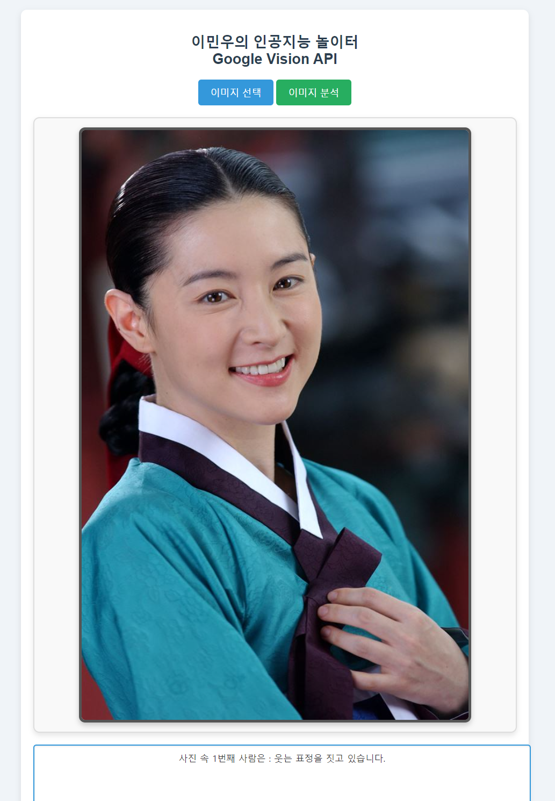

# Project1-2024-2
Ai_Software_Project1_2024_2
2024-09-12
오늘은 날씨도 별로라 학교 재낄까 하다 이교수님 수업 들으러 왔는데 좋았다.


# openweathermap
- 입력된 장소의 현재 날씨를 Openweathe API를 사용해 출력<br>
[OpenWeatherMap실습해보기]("https://openweathermap.org/themes/openweathermap/assets/vendor/owm/img/widgets/")
```javascript
$.ajax({
			type: "GET",
			url: 'https://api.openweathermap.org/data/2.5/weather?q=London&units=metric&appid=7d96bc5108f52b80e2d9075a369b9f35',
		}).done(function(response) {
            console.log(response)
		}).fail(function(error) {
			alert("!/js/user.js에서 에러발생: " + error.statusText);
		});

```
# OPEN AI 
OPEN AI 에서 제공하는 텍스트생성 및 이미지 생성 실습
[OPEN AI 실습해보기](https://platform.openai.com/docs/overview)<br>
- 사용자의 입력부분을 OpenAi API를 사용해 텍스트 형태의 출력값을 가져옴
```javascript
$.ajax({
        type: "POST",
        url: "https://api.openai.com/v1/chat/completions",
        headers: {
            "Authorization": "Bearer " + OPENAPI_KEY
        },
        data: JSON.stringify(data),
        contentType: "application/json; charset=utf-8"
    }).done(function (response) {
        console.log(response)
        //alert(response.choices[0].message.content)
        txtOut.value = (response.choices[0].message.content)
    }).fail(function (error) {
        console.log(error)
        errormsg = error.status + " : " + error.responseJSON.error.code + " - " + error.responseJSON.error.message
        txtOut.value = errormsg
    }
```
- 사용자의 입력부분을 OpenAi API를 사용해 생성된 이미지를 2장 출력함
```javascript
    )
$.ajax({
        type: "POST",
        url: "https://api.openai.com/v1/images/generations",
        headers: {
            "Authorization": "Bearer " + OPENAPI_KEY
        },
        data: JSON.stringify(data),
        contentType: "application/json; charset=utf-8"
    }).done(function (response) {
        console.log(response)
        //alert(response.choices[0].message.content)
        gimage.src = (response.data[0].url)
        gimage2.src = (response.data[1].url)

    }).fail(function (error) {
        console.log(error)
        errormsg = error.status + " : " + error.responseJSON.error.code + " - " + error.responseJSON.error.message
        txtOut.value = errormsg
    }
    )
```
# google cloud vision

google cloud vision 에서 제공하는 FaceDetection 실습

[OpenWeatherMap실습해보기]("https://cloud.google.com/vision?hl=ko")
- 파일 입력 이벤트를 처리하여 이미지를 웹 페이지에 표시하고, 이미지 데이터에서 Base64 문자열을 추출하는 역할을 하는 함수
```js
function processFile(event) {
    const content = event.target.result;
    imagestring = content.replace('data:image/jpeg;base64,', ''); 
    document.getElementById("gimage").src = content; 
}
```
- 파일을 업로드 하는 함수
```js
function uploadFiles(files) {
    const file = files[0];
    const reader = new FileReader();
reader.onloadend = processFile;
    reader.readAsDataURL(file); 
}
```
- FaceDetection정보를 가져오고 출력하는 부분
```javascript
$.ajax({
        type: "POST",
        url: CV_URL,
        headers: {
            "Accept": "application/json",
            "Content-Type": "application/json"
        },
        data: JSON.stringify(data), 
        contentType: "application/json; charset=utf-8"
    }).done(function(response) {
        let resultText = ''; 

         document.getElementById("resultArea").value = resultText;

    }).fail(function(error) {
        console.log("이미지를 분석할 수 없습니다.");
        document.getElementById("resultArea").value = "Error: 이미지를 분석할 수 없습니다.";
    });

```


개발순서
1. 소스수정
2. 소스저장
3. 스테이지
4. 커밋 앤 푸쉬
5. 커밋 메시지

2024-09-19 깃허브 연동 실습
로컬에서 편집함.

2024-10-19 
CapStoneProject 중간과제 제출
이 웹사이트의 기능 :
1. 이미지 업로드 기능 : 사용자는 웹페이지에서 파일 업로드 버튼을 클릭하여 이미지를 업로드할 수 있습니다.
이 이미지는 Base64 형식으로 변환되어 서버로 전송되기 전에 텍스트 형식으로 변환됩니다. 

2. Google Vision API가 이미지 분석 결과를 반환하면, 반환된 데이터에는 이미지 속 사람들의 얼굴 정보와 감정 상태(웃는 표정, 우는 표정, 흐릿한 얼굴 등)가 포함됩니다.
감지된 얼굴이 여러 명일 경우, 각각의 얼굴에 대해 "무표정", "웃는 표정", "우는 표정", "얼굴이 흐릿함" 등의 감정 상태가 표시됩니다.

3. css를 사용해 깔끔한 디자인을 뽑아내었습니다.

1. 텍스트 기반 시스템(우리가 Json형태를 사용함.)과 호환성이 좋은 Base64 형식을 사용.
2. response.responses[0].faceAnnotations 50번쨰 줄에 있는 이코드가 로그창의 faceAnnotations
정보를 가져오는 코드이다.
3. 감정 분석 처리:
얼굴 감지 결과에 포함된 joyLikelihood, sorrowLikelihood, blurredLikelihood 값을 확인하여 
웃는 표정(joyLikelihood), 우는 표정(sorrowLikelihood), 또는 얼굴이 가려져 있거나 흐릿한 경우(blurredLikelihood)를 분석합니다.
4. i문을 접목시켜서 blurredLikelihood부터 시작해 VERY_LIKELY OR LIKELY부분이 떠있다면 출력 아니면 다음 
else if문으로 가서 다른 감정들이 해당하는지 확인하게 코딩했습니다.
5. 그 후 마지막 결과를 textArea부분에 출력되게 했습니다.
+Css